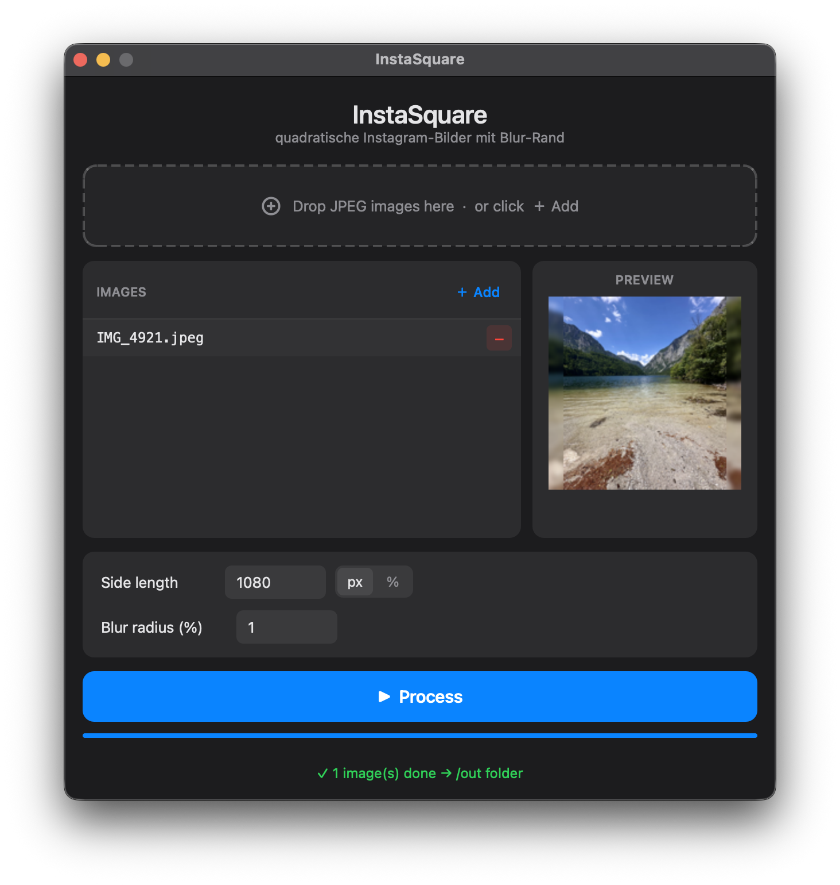

# BatchSquareFill

**BatchSquareFill** turns any photo into a perfect square — without cropping the subject. A blurred copy of the original fills the empty background. Batch-process entire folders in one click.

```
┌──────────────────────┐
│▓▓▓▓▓▓▓▓▓▓▓▓▓▓▓▓▓▓▓▓▓│  ← blurred background (copy of original)
│▓▓▓┌──────────┐▓▓▓▓▓▓│
│▓▓▓│          │▓▓▓▓▓▓│  ← original, scaled to fit
│▓▓▓│  photo   │▓▓▓▓▓▓│
│▓▓▓│          │▓▓▓▓▓▓│
│▓▓▓└──────────┘▓▓▓▓▓▓│
│▓▓▓▓▓▓▓▓▓▓▓▓▓▓▓▓▓▓▓▓▓│
└──────────────────────┘
```

Output is **1080 × 1080 px JPEG** by default — the native resolution for square posts on social platforms. No account, no upload, no subscription. Runs fully offline on your machine.



---

## Features

- **Batch processing** — drop a whole folder, process everything in one click
- **Blur-fill background** — subject always fully visible, no cropping
- **Live preview** — see the result before processing
- **Flexible output size** — absolute px or relative % of original
- **Auto EXIF correction** — iPhone and Android portrait photos always come out right-side up
- **Zero configuration** — one script, dependencies managed automatically

---

## Requirements

Only **[uv](https://docs.astral.sh/uv/)** is required. It handles Python and all dependencies automatically.

```bash
# macOS / Linux
curl -LsSf https://astral.sh/uv/install.sh | sh

# Windows
winget install astral-sh.uv
```

> Python does **not** need to be installed separately.

---

## Installation

```bash
git clone https://github.com/time-stone/BatchSquareFill.git
cd BatchSquareFill
```

No further setup needed.

---

## Running

| Platform | How to launch |
|---|---|
| **macOS** | Double-click `run.command` · first time: right-click → Open |
| **Linux** | Double-click `run.sh` or run `./run.sh` in terminal |
| **Windows** | Double-click `run.bat` |
| **Any platform** | `uv run BatchSquareFill.py` |

On first launch uv downloads Python and installs dependencies into an isolated virtual environment. Subsequent launches start instantly.

---

## Usage

1. **Add images** — drag & drop JPEG files or an entire folder onto the drop zone, or click **＋ Add** to pick individual files
2. **Set parameters:**

   | Parameter | Default | Description |
   |---|---|---|
   | Side length | 1080 px | Output square size. Toggle between **px** (absolute) and **%** (relative to the longer side of the original) |
   | Blur radius | 1 % | Gaussian blur strength as a percentage of the output size — scales automatically when you change the side length |

3. **Click ▶ Process**
4. Results appear in an **`out/`** subfolder next to the source files

Output filename pattern: `originalname_square.jpg`

> Existing files in `out/` are overwritten without prompt.

---

## Output format

| Property | Value |
|---|---|
| Format | JPEG |
| Quality | 92 |
| Chroma subsampling | 4:4:4 (best colour fidelity) |
| Optimisation | enabled |
| EXIF orientation | corrected automatically |

---

## Supported input formats

`.jpg` · `.jpeg`

---

## How it works

1. Open image, correct EXIF rotation
2. **Foreground:** scale so the longer side fits the target square
3. **Background:** scale so the shorter side fills the square, center-crop to exact size, apply Gaussian blur
4. Composite foreground centred over background
5. Export as JPEG to `./out/`

---

## Dependencies

Declared inline via [PEP 723](https://peps.python.org/pep-0723/) — no `requirements.txt` needed.

| Package | Purpose |
|---|---|
| `Pillow` | Image processing |
| `PySide6` | GUI framework |

---

## License

[MIT](LICENSE) · Copyright © 2026 Michael Stolz

---

[](https://claude.ai/code)
